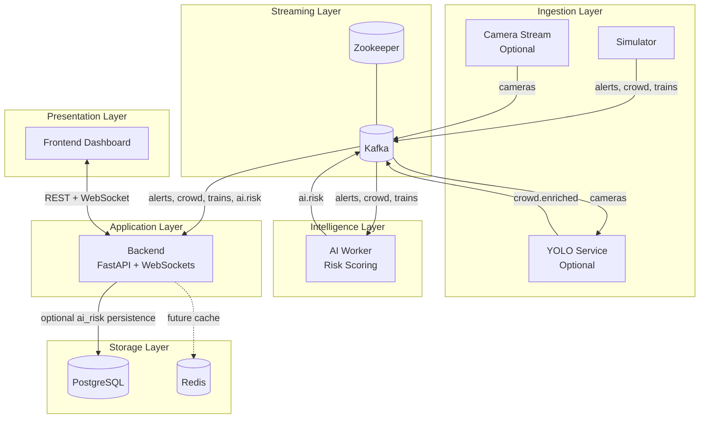
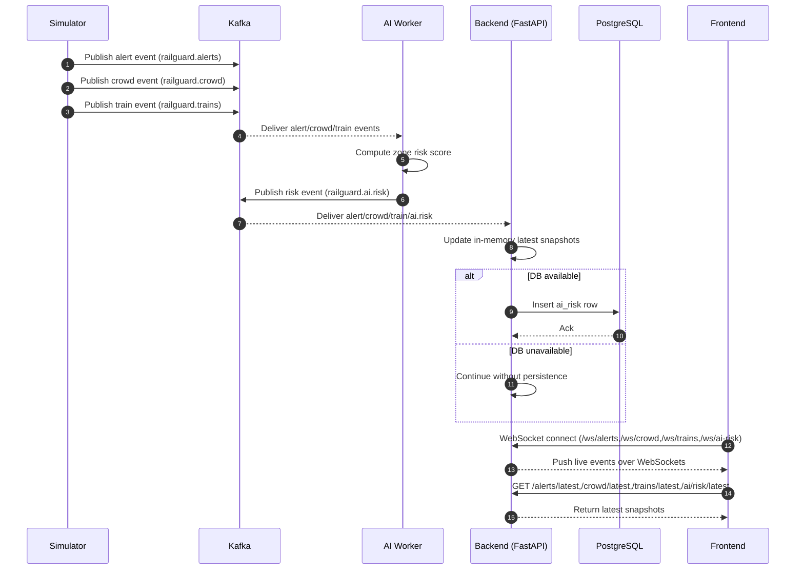

# RailGuard AI Architecture

## System Overview

RailGuard AI is an event-driven, real-time monitoring stack built around Kafka.

- Data producers:
	- Simulator emits synthetic alerts, crowd, and train events.
	- YOLO service (optional) consumes camera events and emits crowd-enriched events.
- Stream processing:
	- AI worker consumes alerts/crowd/trains and publishes per-zone risk scores.
- Serving layer:
	- Backend consumes multiple Kafka topics, stores recent state in memory, optionally persists AI risk snapshots to PostgreSQL, and streams updates via WebSockets.
- Client layer:
	- Frontend subscribes to backend WebSocket endpoints and polls selected REST endpoints.

## Runtime Components

- Kafka + Zookeeper: event bus and broker coordination.
- Backend (FastAPI): API + WebSocket gateway + Kafka consumers.
- Frontend (Vite/React): live dashboard for alerts, crowd, trains, and AI risk.
- Simulator: synthetic telemetry producer.
- AI worker: deterministic weighted risk scoring service.
- YOLO service (optional): camera-to-crowd enrichment pipeline.
- PostgreSQL: optional persistence for AI risk rows.
- Redis: provisioned cache/service dependency for future extensions.

## Kafka Topics

- railguard.alerts
- railguard.crowd
- railguard.trains
- railguard.cameras
- railguard.crowd.enriched
- railguard.ai.risk

## End-to-End Data Flow

1. Simulator publishes events to railguard.alerts, railguard.crowd, and railguard.trains.
2. Optional YOLO service reads railguard.cameras and emits railguard.crowd.enriched.
3. AI worker consumes alerts + trains + crowd (enriched with fallback to raw crowd) and publishes zone risk events to railguard.ai.risk.
4. Backend consumes alerts, crowd, trains, and ai.risk topics, updates in-memory latest views, and writes AI risk snapshots to PostgreSQL when DB is available.
5. Frontend receives live updates from backend WebSockets:
	 - /ws/alerts
	 - /ws/crowd
	 - /ws/trains
	 - /ws/ai-risk
6. Frontend also reads REST endpoints for current snapshots:
	 - /alerts/latest
	 - /crowd/latest
	 - /trains/latest
	 - /ai/risk/latest
	 - /health

## Architecture Diagram (Mermaid)

```mermaid
flowchart LR
		SIM[Simulator]\nalerts crowd trains --> K[(Kafka)]
		CAM[Camera Stream Producer]\noptional --> K
		YOLO[YOLO Service]\noptional
		AI[AI Worker]\nDeterministic Weighted Model
		BE[Backend API]\nFastAPI + WS + Kafka Consumers
		FE[Frontend Dashboard]\nReact + Vite
		PG[(PostgreSQL)]
		RD[(Redis)]

		K -- railguard.cameras --> YOLO
		YOLO -- railguard.crowd.enriched --> K

		K -- railguard.alerts --> AI
		K -- railguard.crowd.enriched / railguard.crowd --> AI
		K -- railguard.trains --> AI
		AI -- railguard.ai.risk --> K

		K -- alerts crowd trains ai.risk --> BE
		BE -- optional ai_risk persistence --> PG

		FE <-- REST + WebSocket --> BE

		BE -. future cache usage .-> RD
```

## Layered Architecture Diagram



## Sequence Diagram (Live Alert Flow)



## Deployment View

- Local/dev orchestration uses Docker Compose in infra/docker-compose.yml.
- External access ports:
	- Frontend: 5173
	- Backend API: 8000
	- Kafka host listener: 9092
	- PostgreSQL: 5432
	- Redis: 6379
